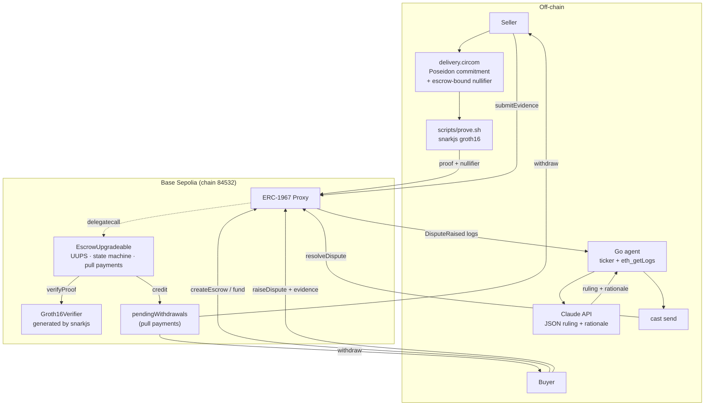
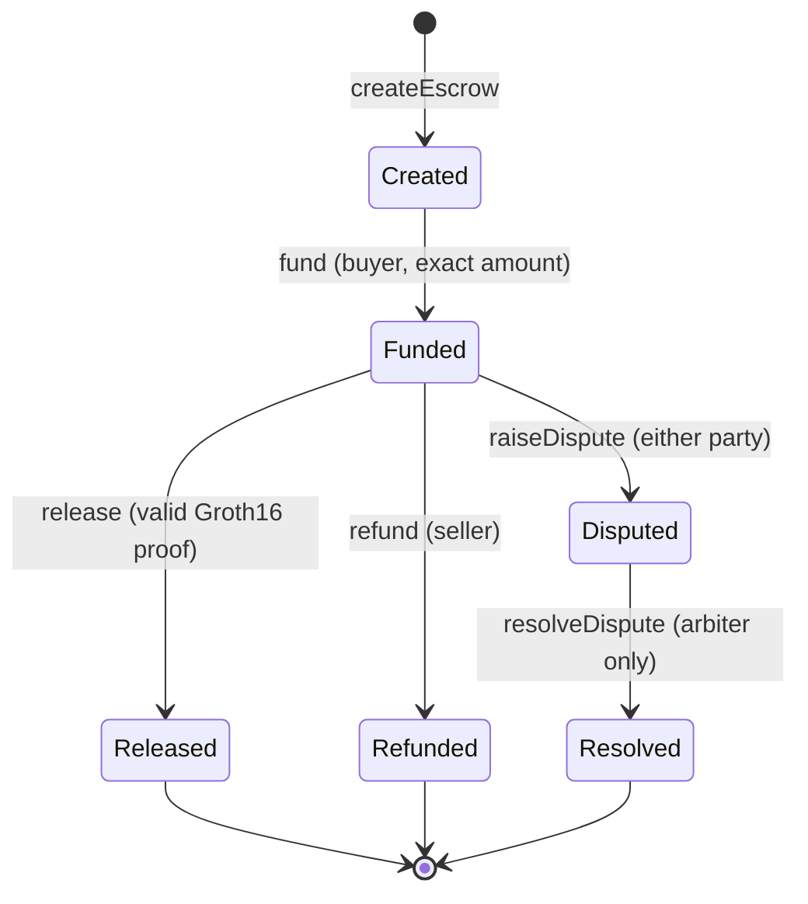

# zk-escrow

[](https://github.com/pigfox/zk-escrow/actions/workflows/ci.yml)


An upgradeable escrow on Base Sepolia with two ways out. On the happy path the
seller releases the funds by proving, in zero knowledge, that they know a
delivery secret — the money moves on a Groth16 proof, not on anyone's say-so,
and the secret never touches the chain. When delivery is contested there is no
proof to be had, so the escrow falls to an arbiter, and the arbiter here is a Go
agent that reads both parties' evidence, asks Claude for a ruling, and executes
it on chain with `cast`. The contract is deliberately built so that the AI
cannot be trusted with more than it needs: `resolveDispute` takes a *side*, not
a destination, so a compromised or hallucinating arbiter can pick the wrong
winner but can never pay itself.

---

## Live on Base Sepolia

| Contract | Address |
| --- | --- |
| **Proxy** ← interact with this | [`0x8bB2ae77AcE1424a9418f32bb2b2077563eE8A84`](https://sepolia.basescan.org/address/0x8bB2ae77AcE1424a9418f32bb2b2077563eE8A84#code) |
| Implementation | [`0x5c3F41Dce28aFA54F9656377aFbF360Cc9310Fb4`](https://sepolia.basescan.org/address/0x5c3F41Dce28aFA54F9656377aFbF360Cc9310Fb4#code) |
| Verifier | [`0xE6372Ff3083B9fea441204BF5617a5afF02e2D56`](https://sepolia.basescan.org/address/0xE6372Ff3083B9fea441204BF5617a5afF02e2D56#code) |

All three verified on BaseScan. Chain id 84532.

Four escrows have run to completion: **#0 and #1 released by zero-knowledge
proof**, **#2 and #3 settled by the AI arbiter**. Across all four the arbiter
routed 0.003 ETH between buyers and sellers and took **nothing** — its
`pendingWithdrawals` balance is `0`, and the contract's ETH balance equals
`totalPendingWithdrawals` to the wei. Invariants (a) and (b) below are not just
fuzzer output; they held against real traffic.

---

## The AI rulings

Both disputes were decided by a model reading the parties' on-chain evidence,
and both rationales are stored verbatim in the `DisputeResolved` event. Nothing
below is paraphrased — it is what the chain says.

### Escrow #3 — both sides heard
[`0x8725c2e7…`](https://sepolia.basescan.org/tx/0x8725c2e7e78baea855f82a744733f16112aa9bc7aeb6fbb0060be6c61f281a8d)
· ruling **SellerWins** · 0.001 ETH to the seller

The buyer complained the tracking number was unrecognised and nothing arrived.
Taken alone that reads as non-delivery. The seller then conceded the number was
mistyped, supplied the corrected one, and cited a signed proof of delivery. The
model weighed the two accounts against each other and **reversed the naive
reading**, because a corrected-and-evidenced account beats an unevidenced one:

> Buyer: you provided that the tracking number you received was unrecognized and
> that nothing arrived, but you did not provide any evidence of non-delivery
> (e.g., carrier claim, return, or proof you never received the package).
> Seller: you credibly corrected the tracking number (explaining the buyer’s
> mistype) and provided that the carrier shows the shipment as delivered and
> signed for on the 5th, with signed proof-of-delivery available. With delivery
> confirmation and no counter-evidence from the Buyer, the escrow should be
> released to the Seller.

### Escrow #2 — arbitration on an incomplete record
[`0xd79a68d3…`](https://sepolia.basescan.org/tx/0xd79a68d3222bac8bcac4f4ebc6f7f41991a964468678a4e28e024e1f773e5fb5)
· ruling **BuyerWins** · 0.001 ETH to the buyer

Only the buyer's evidence reached the chain here: the seller's `submitEvidence`
transaction was the one killed by the sweeper bug described in
[Lessons from a live testnet](#lessons-from-a-live-testnet). The model ruled on
what it actually had, which is the honest behaviour — but it is a one-sided
record, and the ruling should be read as such:

> Buyer provided evidence of timely payment (on the 3rd) and requested next-day
> delivery of a hardware wallet, but the item did not arrive. The tracking
> number provided by the Seller (1Z999AA10123456784) is not recognized by the
> carrier, and Buyer states they asked twice for a replacement tracking number
> and received no response. This supports non-delivery and lack of timely
> communication by the Seller, so the Buyer should be awarded the escrow.

Whatever the model decides, the contract bounds the damage: `resolveDispute`
takes a *side*, not a destination, so a wrong ruling misroutes between the two
parties and can never pay the arbiter. See [Trust model](#trust-model).

---

## Architecture



### State machine



Every settlement credits `pendingWithdrawals`; nothing is ever pushed. Payees
pull via `withdraw()`, which is `nonReentrant` and orders effects before the
external call.

---

## The two-act demo

### Act I — the ZK happy path

```bash
./scripts/demo-happy-path.sh
```

`create → fund → prove → release → withdraw`. The seller generates a proof that
they know `s` such that `Poseidon(s) == commitment`, and the proof releases the
escrow. Note who sends the release transaction: it does not matter. `release()`
is authorized by the proof, not by `msg.sender`.

Escrows [#0](https://sepolia.basescan.org/tx/0xdf38bcdc280addfb012696c6e5fcc6655abedf1648727c012d2f7e096e5a03d7)
and [#1](https://sepolia.basescan.org/tx/0xfedaf8127505c68bc759b86f35dc0158572f5d527844f03794dce7f2acb65f87)
did exactly that on chain — the same secret, so an identical commitment, but a
different nullifier each, both now spent:

```
commitment (both)   4267533774488295900887461483015112262021273608761099826938271132511348470966
nullifier escrow #0  540663689097534992617434090946771188169151136163418449976754366008491461789
nullifier escrow #1 4213355460611018654523924795294902999663126022355729006200928612083214729114
```

That difference is the anti-replay property, live: the nullifier is
`Poseidon(secret, escrowId)`, so escrow #0's proof is not merely rejected
against escrow #1 — it is unprovable there.

### Act II — the AI dispute path

```bash
./scripts/demo-dispute.sh
# then, in another shell:
cd agent && go run .
```

`create → fund → dispute → counter-evidence → agent rules → settle`. The agent
polls for `DisputeRaised`, gathers every submission for the escrow, asks Claude
for a ruling as strict JSON, prints the exact `cast send` it is about to run
(with the key redacted), and executes it. The full rationale is emitted on chain
in the `DisputeResolved` event.

#### Agent configuration

Read from the environment only — `source ../.env` before running.

| Variable | Default | Meaning |
| --- | --- | --- |
| `AI_PROVIDER` | `anthropic` | Reasoning backend: `anthropic` or `openai`. |
| `ANTHROPIC_API_KEY` | — | Required when `AI_PROVIDER=anthropic`. |
| `OPENAI_API_KEY` | — | Required when `AI_PROVIDER=openai`. |
| `START_BLOCK_LOOKBACK` | `5000` | Cold-start scan depth, in blocks. |
| `ESCROW_ADDRESS` | — | The deployed proxy. |
| `PRIVATE_KEY` | — | The arbiter's signing key. Never logged. |

The backend is pluggable because the prompt and the `{ruling, rationale}`
contract are identical either way — only the request envelope differs, so a
ruling does not depend on the vendor. **Only the selected provider's key is
required**: an operator on OpenAI is never asked for an Anthropic key, and the
agent refuses to start if the one it needs is missing, rather than discovering
it on the first dispute. Escrows #2 and #3 above were settled through the OpenAI
backend while Anthropic billing was blocked.

`START_BLOCK_LOOKBACK` matters more than it looks: at Base Sepolia's ~2s blocks
the 5000-block default is only about three hours, and a dispute older than that
is invisible to a fresh agent — see
[Lessons from a live testnet](#lessons-from-a-live-testnet). Raise it when
catching up on a backlog.

---

## Cast one-liners

Set up first:

```bash
set -a; source ../.env; set +a
export ESCROW=0x...            # the proxy address
export RPC=https://sepolia.base.org
```

```bash
# Derive a commitment from a delivery secret (the secret stays local)
node scripts/poseidon.js 12345 0

# Create an escrow (caller becomes the buyer; the three parties must differ)
cast send $ESCROW "createEscrow(address,address,uint256,uint256)" \
    $SELLER $ARBITER 1000000000000000 $COMMITMENT \
    --rpc-url $RPC --chain-id 84532 --private-key $PRIVATE_KEY

# Fund it (buyer only, exact amount)
cast send $ESCROW "fund(uint256)" 0 --value 1000000000000000 \
    --rpc-url $RPC --chain-id 84532 --private-key $PRIVATE_KEY

# Generate a proof, then release with it (anyone may send this)
./scripts/prove.sh 12345 0
cast send $ESCROW "release(uint256,uint256,uint256[2],uint256[2][2],uint256[2])" \
    0 $NULLIFIER $PA $PB $PC \
    --rpc-url $RPC --chain-id 84532 --private-key $PRIVATE_KEY

# Seller returns the money without a dispute
cast send $ESCROW "refund(uint256)" 0 \
    --rpc-url $RPC --chain-id 84532 --private-key $SELLER_KEY

# Escalate, and add evidence afterwards
cast send $ESCROW "raiseDispute(uint256,string)" 0 "nothing arrived" \
    --rpc-url $RPC --chain-id 84532 --private-key $PRIVATE_KEY
cast send $ESCROW "submitEvidence(uint256,string)" 0 "signed POD attached" \
    --rpc-url $RPC --chain-id 84532 --private-key $SELLER_KEY

# Arbiter rules. 0 = BuyerWins, 1 = SellerWins
cast send $ESCROW "resolveDispute(uint256,uint8,string)" 0 1 "tracking confirms delivery" \
    --rpc-url $RPC --chain-id 84532 --private-key $PRIVATE_KEY

# Pull your money out
cast send $ESCROW "withdraw()" \
    --rpc-url $RPC --chain-id 84532 --private-key $PRIVATE_KEY

# Reads
cast call $ESCROW "getState(uint256)(uint8)" 0 --rpc-url $RPC
# 0 None · 1 Created · 2 Funded · 3 Released · 4 Refunded · 5 Disputed · 6 Resolved
cast call $ESCROW "pendingWithdrawals(address)(uint256)" $ADDRESS --rpc-url $RPC
cast call $ESCROW "nullifierUsed(uint256)(bool)" $NULLIFIER --rpc-url $RPC
cast logs --address $ESCROW \
    "DisputeResolved(uint256,address,uint8,address,uint256,string)" --rpc-url $RPC
```

> **On `--private-key`.** `cast` only accepts signing keys as command-line
> arguments — it will not read them from the environment. The demo scripts
> therefore build the *echoed* form of every command separately from the
> executed one and substitute `***REDACTED***`, so no key is ever printed. The
> real value still appears in the process's argv, which is visible to other
> local users via `ps`. On a shared machine, use a key you are willing to treat
> as public. See [Trust model](#trust-model).

---

## Building the circuit

Requires Node 20+, [circom 2.1.9+](https://docs.circom.io/getting-started/installation/)
and the pinned npm dependencies.

```bash
npm install                  # circomlib 2.0.5, circomlibjs 0.1.7, snarkjs 0.7.5
./scripts/build-circuit.sh   # compile + trusted setup + export src/Verifier.sol
./scripts/prove.sh 12345 0   # generate a proof for secret=12345, escrow #0
```

`build-circuit.sh` writes `src/Verifier.sol` (checked in) and proving artifacts
into `circuits/build/` (gitignored). Only the `.circom` source, the scripts and
the generated verifier are tracked.

> Re-running `build-circuit.sh` performs a *fresh* setup, so the verification
> key — and with it `src/Verifier.sol` — changes. The checked-in fixture proofs
> were generated against the previous key and must be regenerated alongside it;
> the script header gives the two commands. `forge test` fails loudly if you
> forget, so this cannot slip through silently.

The circuit is 932 R1CS constraints — one private input (`secret`), two public
inputs (`commitment`, `escrowId`) and one public output (`nullifier`).

> ### ⚠ The trusted setup is demo-grade
>
> `build-circuit.sh` generates the powers-of-tau **and** the phase-2
> contribution locally, on one machine, with entropy the script supplies itself.
> Whoever runs it knows the toxic waste and could forge proofs for this circuit
> at will. That is acceptable for a Base Sepolia demo and unacceptable for real
> value. Production needs a multi-party ceremony — a Perpetual Powers of Tau
> file plus independent phase-2 contributors — where no single participant sees
> all the randomness.

### npm advisories

`package.json` carries `overrides` pinning `ws`, `underscore` and `elliptic`
forward past their advisories, because the direct dependencies (`snarkjs`,
`circomlibjs`) have no releases that do it themselves. That clears every high
and moderate finding.

What remains is 15 low-severity findings, all one root cause: `elliptic@6.6.1`
is the newest published version and its advisory has no fix. It reaches the
tree through `circomlibjs → ethers@5`, and nothing here signs with it — the
only thing this project uses `circomlibjs` for is computing Poseidon hashes.
It is not in the trust path for proofs or for any key.

### Why the nullifier is derived from the escrow id

`commitment = Poseidon(secret)` and `nullifier = Poseidon(secret, escrowId)`.
Binding the nullifier to the escrow is what makes replay *unprovable* rather
than merely rejected: the same secret yields a different nullifier per escrow,
and the contract stores spent nullifiers, so one proof settles exactly one
escrow exactly once. `test_Release_RejectsProofFromAnotherEscrow` pins this with
two real checked-in proofs that share a commitment and differ in nullifier.

---

## Testing

```bash
forge test                  # 103 tests: unit, fuzz, invariants
./scripts/coverage.sh       # coverage gate — fails below 100% on src/
echidna . --contract Properties --config echidna.yaml
medusa fuzz --config medusa.json
slither . --config-file slither.config.json
cd agent && go test ./... -race -coverprofile=coverage.out
```

### One property contract, three engines

`test/Properties.sol` is the single source of truth for the invariants, consumed
by **Foundry**, **Echidna** and **Medusa** alike, so a property cannot hold in
one engine and silently rot in another. Six properties:

- **(a)** the contract's ETH balance always equals the sum of its obligations —
  amounts credited to payees *plus* amounts still locked against `Funded` or
  `Disputed` escrows. Both halves are recomputed independently of the contract's
  own bookkeeping, so a bug in `totalPendingWithdrawals` cannot hide behind
  itself.
- **(b)** no settlement ever credits the arbiter *of the escrow it settles*.
  This is a flow-level check, not an address-level one: each wrapper snapshots
  that escrow's arbiter around the call and flags an increase. An address may
  legitimately hold credits it earned as the buyer or seller of some *other*
  escrow, which is exactly the state the rotating actor pool produces, so
  "this address holds zero" would be the wrong question to ask.
- **(c)** every escrow only ever moves along an edge of the declared state
  machine.
- **(d)** obligations never exceed the total ever funded — nothing can be owed
  that was never paid in.
- **(e)** a nullifier settles at most one escrow, ever. Nullifiers are bounded
  into a pool of eight so that collisions actually *occur* inside a fuzz
  sequence; with a raw `uint256` the fuzzer never collided, so the replay guard
  was never exercised and this property passed vacuously while looking green.
- **(f)** the progress ledger is consistent: every ghost success counter is
  dominated by an opportunity registered in the same call frame. Without this,
  the canary below can silently start asserting luck instead of behaviour.

The harness drives every party as a real `Actor` contract rather than a
cheatcode prank, because Echidna and Medusa have no `prank` — without that, the
fuzzers would bounce off `resolveDispute`'s access-control guard forever and
never reach `Resolved`. It rotates a pool of six actors, deriving three distinct
roles per escrow from the fuzz input, so one address can be the seller of one
escrow and the buyer or arbiter of another. A fixed party triple can never
produce the case where an address is owed money from two escrows in two
different capacities. `test/PropertiesHarness.t.sol` exists to prove the harness
is not vacuous: it walks every terminal state deterministically, so a green fuzz
run means something.

### The harness audits itself

A property suite that never reaches an interesting state reports green forever,
which is indistinguishable from a correct protocol. So `afterInvariant` asserts
the run was not inert — but as *implications*, not raw counts: each opportunity
counter tallies only calls whose preconditions were all satisfied, and the
assertion is that anything which should have succeeded did. Raw counts flake,
because `afterInvariant` fires after every run of every invariant — roughly 1500
samples per `forge test` — and a sequence that draws no `fund` selector in 64
picks is unlucky, not broken. That canary then caught a real defect in itself:
`fund` picked uniformly over every escrow ever created, so its hit rate decayed
as a sequence ran and whole runs were starved of any funded escrow. `fund` now
splits on its seed — three quarters scan forward for a `Created` escrow, one
quarter keeps the uniform pick so the state guard still gets probed with
wrong-state calls, which are counted separately rather than diluting the
conversion rate the canary measures.

### What CI enforces about the fuzzers

Three guards, each closing a way a fuzz suite can fail by looking green.

`fail_on_revert = true`. Every harness entry point swallows its expected
reverts by design, so a revert reaching the engine is a harness bug rather than
a protocol finding — and left unchecked it silently shrinks the search space.

`EXPECTED_PROPERTIES`. Both fuzz jobs assert the run registered exactly that
many properties. A predicate that stops being picked up — a rename, a bad
build — otherwise reports as a smaller green run, not an error.

A forced rebuild before each fuzzer. `forge coverage` overwrites `out/` with
coverage-instrumented artifacts, and crytic-compile consumes those, or a stale
`crytic-export/`, without complaint — registering a property set that does not
match the source. That once cut the suite to four of five properties silently.
Each fuzz job now deletes `crytic-export/` and runs `forge build --force`
immediately beforehand, unconditionally, so a future job reorder cannot bring
it back.

### Coverage

| Target | Lines | Statements | Branches | Functions |
| --- | --- | --- | --- | --- |
| `src/EscrowUpgradeable.sol` | **100%** (92/92) | **100%** (116/116) | **100%** (20/20) | **100%** (16/16) |
| `src/Verifier.sol` *(excluded — see below)* | 93.65% | 93.22% | 33.33% | 100% |
| Go agent (all packages) | — | **100.0%** | — | — |

Both gates are hard failures in CI, not reports.

#### The one documented exclusion: `src/Verifier.sol`

`scripts/coverage.sh` requires 100% on all four metrics for every file under
`src/`, with exactly one exclusion. `Verifier.sol` is generated verbatim by
snarkjs from the proving key. Its residual uncovered lines are the
inline-assembly early-exit paths taken when the BN254 `ecAdd` / `ecMul` /
pairing **precompiles themselves** report failure. Those cannot be provoked from
a test: inputs that are merely wrong — off-curve points, out-of-range field
elements — are rejected by the reachable `checkField` branch, which *is* covered
by `test_Verifier_RejectsOutOfRangeNullifier` and friends. Reaching the rest
would require a broken EVM, not a broken proof.

The verifier is not untested for it. `test/ZkRelease.t.sol` drives real Groth16
proofs through the escrow end to end, including tampered public signals,
off-curve points, zero proofs, wrong commitments and cross-escrow replay.

Analyzer exclusions are documented the same way, in
[`docs/slither-exclusions.md`](docs/slither-exclusions.md) — seven detectors,
six of which fire only on the generated verifier. CI fails on any finding that
survives them.

---

## Lessons from a live testnet

Everything below was found by running against Base Sepolia, not by testing.
Each one passed unit tests, CI, both fuzzers and Slither first.

**snarkjs and cast disagree about arrays.** snarkjs exports proof points as
quoted, comma-space JSON (`["0xab", "0xcd"]`); `cast` array literals are bare
and unspaced (`[0xab,0xcd]`) and it rejects the other form outright. Act I died
at the release step on the first run. `prove.sh` now emits both encodings —
`pA`/`pB`/`pC` for the Solidity fixtures, `castPA`/`castPB`/`castPC` for
anything shelling out.

**Published test keys are actively swept, and the failure is misdirected.** The
demos originally used the standard Anvil accounts for the throwaway
seller/buyer. Their private keys ship with every Foundry install, so on a public
testnet they are drained continuously — Base Sepolia's Anvil #4 sits at nonce
229 and carries an **EIP-7702 delegation** (`0xef0100…`) to a sweeper contract.
Funding it does not fail; the transfer succeeds and is forwarded away
atomically in the same transaction, leaving the account at zero. The symptom
surfaces three steps later as `gas required exceeds allowance (0)`, which points
at entirely the wrong thing. The demos now generate real random identities on
first run and cache them in a gitignored, `0600` `.demo-keys.env`, and
`fund_to()` re-reads the balance after transferring rather than trusting the
receipt.

**Redaction as a list of names silently rots.** `run()` masked `PRIVATE_KEY` and
`SELLER_KEY` before echoing each `cast` command — but a later edit introduced
`SELLER2_KEY`, which printed in clear. It happened to be a published key, so
nothing secret leaked, but the same logic would have leaked an operator's. The
enumerated list is now a registry: keys are registered as they are obtained and
`run()` masks anything in it, so adding a key cannot quietly bypass redaction.

**100% statement coverage did not catch a ten-block miss.** The agent begins
scanning `StartBlockLookback` blocks behind head, and 5000 blocks is about three
hours of Base Sepolia. By the time the disputes were settled they had aged past
that: a fresh agent started at block 44347290 while escrow #3's dispute sat at
44347280 — **ten blocks out of reach** — and reported nothing at all rather than
an error. `START_BLOCK_LOOKBACK` now overrides the window. The regression test
asserts the override *moves the first scanned block*, not merely that the branch
executes; branch-execution coverage was already 100% and would have missed this
exactly as it did the first time.

The through-line: the contract logic was fine every time. What broke was
everything around it — encodings, key hygiene, operational windows — which is
the part a test suite is worst at reaching.

## Trust model

The interesting question is not "is the AI right?" but "what happens when it is
wrong?" The contract is designed so that the answer is bounded.

**The arbiter is a trusted oracle, and only that.** It decides *who wins*, never
*where the money goes*. `resolveDispute(escrowId, ruling, rationale)` takes a
`Ruling` enum — `BuyerWins` or `SellerWins` — and derives the beneficiary from
that escrow's own stored parties. There is no parameter, and no branch, that
lets funds reach the arbiter or a third address. `createEscrow` additionally
rejects an arbiter equal to either party. Invariant (b) is fuzzed against this
by all three engines.

**The agent's key is gas-dust-only and testnet-only.** It signs one kind of
transaction on Base Sepolia. Its worst case, fully compromised, is: rule wrongly
on disputes it is the named arbiter for, sending the escrowed amount to *the
other party in that trade*. It cannot drain the contract, cannot touch escrows
where it is not the arbiter, cannot upgrade anything (that is `owner`, a
separate role — `test_ResolveDispute_RevertsForOwnerWhoIsNotArbiter` pins the
separation), and cannot pay itself. Fund it with dust; treat the key as public.

**What is genuinely trusted:** that Claude's ruling is a fair reading of the
evidence, and that the evidence on chain is the real evidence. Neither is
enforced by anything. The model sees only what the parties published in
`DisputeRaised` events, and a party can lie there as easily as anywhere else.

### Hardening paths (future work)

None of these are implemented — this is a demo, and saying so is more useful
than implying otherwise.

- **Multi-model quorum.** Route each dispute to several independent models and
  require agreement before executing. Turns a single hallucination from a wrong
  ruling into a no-op.
- **Challenge window.** Have `resolveDispute` stage a ruling rather than settle
  it, with a fixed delay in which the losing party can escalate to a human or a
  bonded challenger. Makes a wrong ruling recoverable rather than final.
- **TEE attestation.** Run the agent in an enclave and post an attestation
  alongside the ruling, so observers can verify *which* model saw *which*
  evidence. Closes the gap where the operator, not the model, chooses the
  outcome.
- **Evidence commitments.** Require parties to commit to evidence before the
  dispute opens, so neither side can tailor its story to the other's.
- **Bonded disputes.** Make raising a dispute cost something refundable on a
  win, to price out frivolous escalation.

---

## Deployment reference

The three addresses are at the [top of this README](#live-on-base-sepolia).
Deployed 2026-07-19 to chain id 84532; the upgrade authority is
[`0x49FE3B27…`](https://sepolia.basescan.org/address/0x49FE3B2731090b93d297D259BD1eFFC5DB015edF).

```bash
export ESCROW_ADDRESS=0x8bB2ae77AcE1424a9418f32bb2b2077563eE8A84
```

All three are verified on BaseScan against solc `v0.8.28+commit.7893614a` with
the optimizer on at 200 runs — the same settings `foundry.toml` pins, so the
published source matches what the tests and fuzzers ran against.

<details>
<summary>Reproducing the verification</summary>

The deploy itself ran without an `ETHERSCAN_API_KEY`, so verification was done
after the fact. With the key set in `../.env`:

```bash
set -a; source ../.env; set +a

forge verify-contract 0xE6372Ff3083B9fea441204BF5617a5afF02e2D56 \
    src/Verifier.sol:Groth16Verifier \
    --chain-id 84532 --etherscan-api-key "$ETHERSCAN_API_KEY" --watch

forge verify-contract 0x5c3F41Dce28aFA54F9656377aFbF360Cc9310Fb4 \
    src/EscrowUpgradeable.sol:EscrowUpgradeable \
    --chain-id 84532 --etherscan-api-key "$ETHERSCAN_API_KEY" --watch

forge verify-contract 0x8bB2ae77AcE1424a9418f32bb2b2077563eE8A84 \
    lib/openzeppelin-contracts/contracts/proxy/ERC1967/ERC1967Proxy.sol:ERC1967Proxy \
    --chain-id 84532 --etherscan-api-key "$ETHERSCAN_API_KEY" --watch \
    --constructor-args "$(cast abi-encode 'constructor(address,bytes)' \
        0x5c3F41Dce28aFA54F9656377aFbF360Cc9310Fb4 \
        "$(cast calldata 'initialize(address,address)' \
            0xE6372Ff3083B9fea441204BF5617a5afF02e2D56 \
            0x49FE3B2731090b93d297D259BD1eFFC5DB015edF)")"
```

The proxy's constructor args encode the implementation address plus the
`initialize(verifier, owner)` calldata; they match the arguments recorded in
`broadcast/Deploy.s.sol/84532/run-latest.json` byte for byte.

</details>

> **One manual step remains.** BaseScan has the proxy's source but has not yet
> been told it *is* a proxy, so it does not expose Read/Write-as-Proxy or link
> through to the implementation's ABI. That detection is a UI action and cannot
> be scripted: open the [proxy address](https://sepolia.basescan.org/address/0x8bB2ae77AcE1424a9418f32bb2b2077563eE8A84#code)
> → **Contract** → **More Options** → **Is this a proxy?** → **Verify**. Until
> then, interact via `cast` (every one-liner above works regardless) or through
> the implementation's ABI.

### Deployment transactions

| Contract | Tx |
| --- | --- |
| `Groth16Verifier` | [`0x1381d46a…`](https://sepolia.basescan.org/tx/0x1381d46ab23cab5d5bd45d89189987bd9c3194630bc983d91486e6c3f55ad015) |
| `EscrowUpgradeable` | [`0xbc5456e6…`](https://sepolia.basescan.org/tx/0xbc5456e64bc7a6780b0abc57f185105a9c0a760a6b8ea4f6498b1880e684bc03) |
| `ERC1967Proxy` | [`0xb4d8bcb6…`](https://sepolia.basescan.org/tx/0xb4d8bcb62bc1a6998d274a3816b28985ef75b6cb0d27fc9678635c02346169cd) |

All three succeeded (receipt status `0x1`), for a total of 0.0000139929 ETH in
gas. Post-deploy state was checked on chain: `verifier()` returns the deployed
verifier, `owner()` returns the deployer, the ERC-1967 implementation slot holds
the implementation address, and `initialize()` reverts on a second call.

---

## Setup

Secrets live in `../.env` — **one directory above this repository**, so they
cannot be committed. Nothing in the build, test or CI path reads them; they are
needed only to deploy and to run the agent.

```bash
cp .env.example ../.env
$EDITOR ../.env          # ADDRESS, PRIVATE_KEY, ANTHROPIC_API_KEY
set -a; source ../.env; set +a
```

| Variable | Needed for |
| --- | --- |
| `ADDRESS` | deploy, demos |
| `PRIVATE_KEY` | deploy, demos, agent |
| `ANTHROPIC_API_KEY` | agent only, when `AI_PROVIDER` is `anthropic` (the default) |
| `OPENAI_API_KEY` | agent only, when `AI_PROVIDER=openai` |
| `AI_PROVIDER` | optional — `anthropic` (default) or `openai` |
| `START_BLOCK_LOOKBACK` | optional — cold-start scan depth in blocks (default 5000, ~3h) |
| `ESCROW_ADDRESS` | demos, agent (after deploy) |
| `ETHERSCAN_API_KEY` | optional — BaseScan verification |

Then:

```bash
forge build
npm install && ./scripts/build-circuit.sh
./scripts/deploy.sh      # Base Sepolia only; chain id 84532 is asserted twice
```

`deploy.sh` exits cleanly with instructions if the credentials are not populated
yet — missing operator credentials are not a build failure.

---

## Layout

```
src/EscrowUpgradeable.sol   UUPS escrow: state machine, pull payments, ZK release
src/Verifier.sol            generated Groth16 verifier (do not edit by hand)
src/IVerifier.sol           the interface the escrow depends on
circuits/delivery.circom    the delivery-secret circuit
scripts/                    build-circuit, prove, deploy, coverage, the two demos
script/Deploy.s.sol         forge deployment script (asserts chain 84532)
test/Properties.sol         shared invariants: Foundry + Echidna + Medusa
test/fixtures/              real Groth16 proofs, generated once and checked in
agent/                      the Go AI arbiter (100% covered)
docs/slither-exclusions.md  every suppressed detector, with rationale
```

## Licence

MIT, except `src/Verifier.sol`, which snarkjs emits under GPL-3.0.
